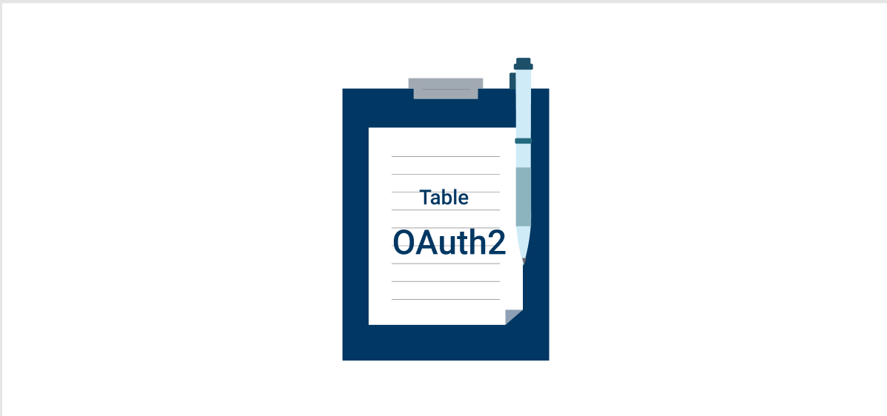

# OAuth2 template


## Login


## Authorized user


### Getting public data from Facebook
```
 FBSDKGraphRequest(graphPath: "me",
                   parameters: ["fields": "id, name, email, first_name, last_name, picture.type(large)"])?.start(completionHandler: { (_, result, error) in
            if let error = error {
                print(error)
                return
            }
            guard let userData = result as? [String: Any] else { return }
            self.userProfile = UserProfile(data: userData)
            self.saveIntoFirebase()
        })
```


### Saving data to Firebase

```
private func saveIntoFirebase() {
        guard let uid = Auth.auth().currentUser?.uid else { return }
        
        Database.database().reference().child("users")
          .updateChildValues([uid: userProfile?.fetchUserData() as Any]) { (error, _) in
            if let error = error {
                print(error)
                return
            }
            self.acivityIndicator.stopAnimating()
            self.customFBLoginButton.isHidden = false
            self.openMainViewController()
        }
        
        
    }
```


## Podfile dependency

```
	pod 'FBSDKCoreKit'
	pod 'FBSDKLoginKit'
	pod 'Alamofire'
	pod 'Firebase/Auth'
	pod 'Firebase/Database'
```


